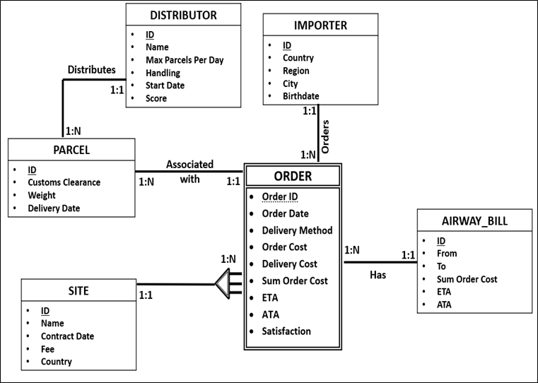
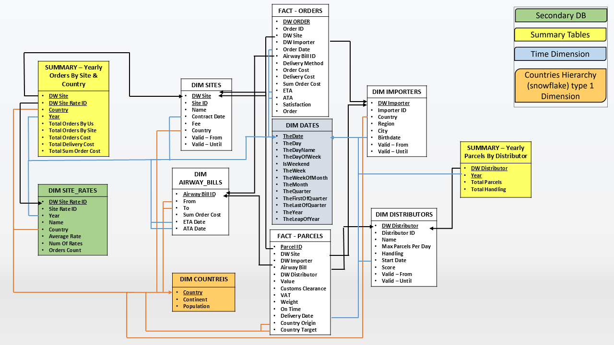
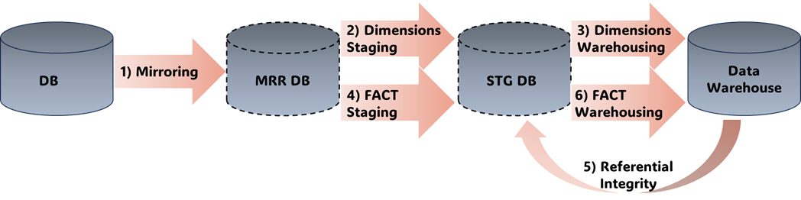
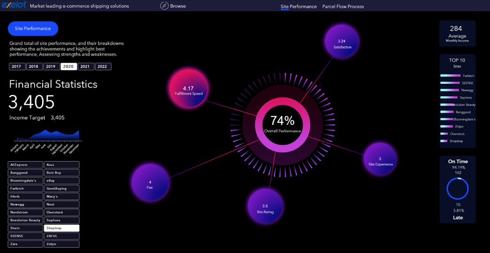
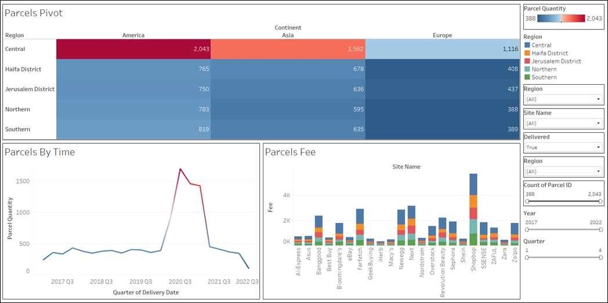

# **Business Intelligence & Analytics (BI&A) Project**
### **Data Infrastructure, ETL, and Business Insights Development**

## **📌 Project Overview**
This project focuses on **building a full-scale Business Intelligence (BI) system**, covering both **data infrastructure** and **business analytics tools**. The implementation consists of **two major parts**:

1. **Part 1: Characterization & Data Infrastructure**  
   - Designing **operational and analytical databases**.
   - Implementing **ETL processes** for data extraction, transformation, and loading.
   - Ensuring **data integrity and referential checks**.

2. **Part 2: Business Intelligence & Analytics Implementation**  
   - Developing **business reports and dashboards** for decision-making.
   - Implementing **OLAP analysis** and advanced **data visualizations**.
   - Conducting **performance evaluations of e-commerce platforms**.

---

## **📂 Project Structure**
```
📁 Business Intelligence & Analytics Project
│── 📁 DB-Data                        # Source data (Excel files)
│── 📁 Part1-Characterization & Data Infrastructure Establishment
│    │── 📁 1-Database_Setup          # SQL scripts for database creation
│    │── 📁 2-ETL_Processes           # Source-to-target mapping & ETL scripts
│    │── 📁 3-Data_Integrity_Checks   # Referential integrity validation
│    │── 📁 4-Slow_Changing_Dimensions # Historical data management
│    └── 📄 Project Overview-Part1.pdf # Detailed explanation of Part 1
│
│── 📁 Part2-BI&A                     # Business intelligence implementation
│    │── 📁 PartA-Business Reports    # Strategic & tactical decision reports
│    │── 📁 PartB-Interactive_Dashboard   # Interactive Tableau visualizations
│    │── 📁 PartC-OLAP                # On-Line Analytical Processing analysis
│    │── 📁 PartD-Advanced_Visualizations  # Specialized BI charts & insights
│    └── 📄 Project Overview-Part2.pdf     # Detailed explanation of Part 2
│
└── 📄 README.md                      # This project description
```

---

## **🚀 Technologies & Tools Used**
| **Category**            | **Tools & Technologies**      |
|-------------------------|-------------------------------|
| **Database Management** | SQL Server                    |
| **ETL Processes**       | SQL, Tableau-Prep             |
| **Data Warehousing**    | Star Schema, Snowflake Schema |
| **BI & Visualization**  | Tableau, Excel Dashboards     |
| **Advanced Analytics**  | OLAP, Data Mining             |   

---

## **📊 Part 1 - Data Infrastructure & ETL**
### **🔹 Database Setup & Schema Design**
- Designed **operational and analytical databases** using a **Star Schema approach**.
- Implemented **Slowly Changing Dimensions (SCD Type 2)** for tracking historical data.
- **ERD Models** were created to define entity relationships.

📌 **Files:**  
- **SQL scripts** for creating the **operational DB**, **staging DB**, and **data warehouse**.
- **ETL process definitions** in **Tableau Prep & SQL**.

🖼 **ERD Diagram:**



🖼 **Data Warehouse Schema (Star Schema):**



---

### **🔹 ETL Process (Extract, Transform, Load)**
- **Step 1:** Extract data from multiple sources (**DB-Data folder**).
- **Step 2:** Perform **data cleansing, transformations, and aggregations**.
- **Step 3:** Load data into the **staging area → data warehouse**.

📌 **Files:**  
- **ETL Scripts in SQL & Tableau Prep**
- **Source-To-Target Mapping Document (STT.xlsx)**

🖼 **ETL Process Flow:**




---

## **📊 Part 2 - Business Intelligence & Analytics**
### **🔹 Business Reports for Decision Making**
📌 **Reports:**
1. **Tactical Report:**  
   - _Should we offer home delivery upgrades?_  
   - Evaluates **importer satisfaction** and **delivery efficiency**.

2. **Strategic Report:**  
   - _Should we work with additional distributors?_  
   - Measures **logistics efficiency** and **capacity utilization**.

---

### **🔹 Interactive Dashboards & Advanced Visualizations**
📌 **Features:**
- **Senior Management Dashboard** → _Revenue, expenses, and market performance._
- **E-commerce Performance Visualization** → _Evaluates top-performing online retailers._

🖼 **Visualizations Sample (interactive dashboard):**




---

### **🔹 OLAP Analysis**
📌 **Features:**
- **OLAP Cube Analysis** for data slicing and drilling down. 
- For more details, refer to: 📄 [OLAP-StoryTelling](Part2-BI&A/PartC-OLAP/OLAP-StoryTelling.pptx)

🖼 **OLAP Chart:**




---

## **🎬 Video Demonstrations**
**Available in Folders:**
- 📁 **3-Data_Integrity_Checks**
- 📁 **4-Slow_Changing_Dimensions**

📌 **Includes:** Referential Integrity Check & Slowly Changing Dimensions Demo.

---

